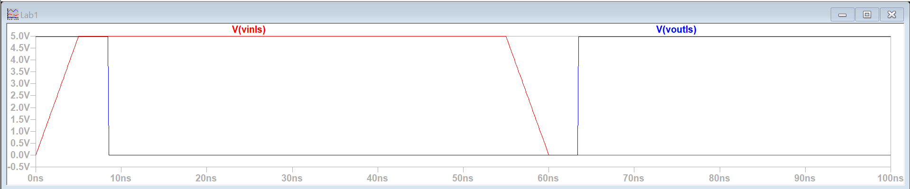

# Lab01 - Comparación de tecnologías CMOS y TTL

## Integrantes

[Sergio Andrés Bolaños Penagos](https://github.com/sergiosinlimites)
 
[Juan José Rincon](https://github.com/)
 
[Johan Camilo Patiño Mogollon](https://github.com/)

## Informe
# Informe de Práctica I: Electrónica Digital I

## Objetivos

El objetivo de esta práctica es estudiar las características de dispositivos lógicos fabricados en tecnologías TTL y CMOS mediante el análisis teórico de sus especificaciones. Posteriormente, se implementará una operación lógica para observar diferencias en parámetros como tiempo de respuesta, disipación de potencia y fan-out.

## Resumen Teórico

La electrónica digital utiliza diferentes tecnologías para construir circuitos lógicos, y entre las más comunes están las tecnologías **TTL (Transistor-Transistor Logic)** y **CMOS (Complementary Metal-Oxide-Semiconductor)**. Cada tecnología tiene características específicas que afectan el rendimiento y las aplicaciones de los circuitos. En esta práctica se examinan dos negadores:

- **Negador TTL 74LS04**
- **Negador CMOS 74HCT04 compatible TTL**

Estas tecnologías difieren en términos de voltaje de operación, disipación de potencia, tiempos de retardo y capacidad de carga (fan-out), lo que afecta su idoneidad en diferentes aplicaciones electrónicas.

## Circuitos Equivalentes
### Circuito de: 74HCT04

CMOS: 
La tecnología CMOS tiene como principio de funcionamiento interno el estar conformada por dos transistores MOSFET, uno de canal N y otro de canal P, los cuales se encuentran complementados, es decir que mientras uno se encuentra activo el otro no. 

Transistor MOSFET canal N: 
EL MOSFET de canal N se caracteriza por permitir el paso de corriente cuando el voltaje VGS (Diferencia de potencial entre la puerta y la fuente) es mayor al Voltaje de umbral.
Este es implementado como la conexión entre GND y la salida de la compuerta cuando se encuentra activo. 
Transistor MOSFET canal P: 
EL MOSFET de canal P se caracteriza por permitir el paso de corriente cuando el voltaje VSG (Diferencia de potencial entre la fuente y la puerta) es mayor al valor absoluto del Voltaje de umbral.
Este es implementado como la conexión entre el voltaje de alimentación y la salida de la compuerta cuando se encuentra activo.

Cuando la entrada está a un voltaje alto, el NMOS se activa (porque V_GS > V_th) y conecta la salida a tierra, lo que da como resultado un cero logico. El PMOS se apaga porque V_GS es demasiado positivo o en otras palabras (V_SG < ∣Vt_h∣). Cuando la entrada está a un voltaje bajo, el PMOS se activa y conecta la salida a VDD (alimentación), mientras que el NMOS se apaga.

CIRCUITO:

 

 SIMULACIÓN:

  

#### Circuito equivalente de: 74HCT04
 
AQUI TOCA HACER LAS COMPUERTAS CMOS EN LTSPICE

### Circuito de: 74LS04 

TTL: 
La tecnología TTL tiene como principio de funcionamiento interno el estar conformada por un transistor BJT NPN, aunque dependiendo de la configuración se pueden incluir mas componentes. 

Transistor BJT NPN: 
EL BJT NPN en un TTL basico se utiliza como interruptor en donde al recibir un 1 logico (Voltaje superior al de umbral) este se activa y se conecta a GND entregando un 0 logico 

En otras configuraciones se puede incluir un segundo transistor NPN (Q2) que cumple la función de "limitador" con el objetivo de evitar que el transistor Q1 (es decir el principal) alcance un voltaje muy elevado.

<b>CIRCUITO:</b>

<b>SIMULACIÓN:</b>

#### Circuito equivalente de: 74LS04

 
## Comparación de Dispositivos TTL y CMOS

### Características Generales

| Característica               | TTL (74LS04)                    | CMOS (74HCT04)                  |
|------------------------------|----------------------------------|--------------------------------|
| Voltaje de operación         | 5V                              | 5V                      |
| Rango de temperatura         | 0 °C a 70 °C                   | -40 °C a 85 °C                |
| Tiempo de retardo de propagación | 10 ns | 0-500 ns           |
| Disipación de potencia       | 1 mW - 20 mW por compuerta     | 0.2 mW - 10 mW                 |
| Corriente de salida          | 8 mA | 20 mA mA                         |
| Número de compuertas         | 6 | 6 |
| Número de pines              | 14 | 14 |

### Voltajes de entrada y salida

Cada dispositivo tiene niveles de voltaje de entrada y salida para distinguir entre estados lógicos de "0" y "1". A continuación, se muestran los voltajes requeridos:

| Parámetro                       | TTL (74LS04)                     | CMOS (74HCT04)                 |
|---------------------------------|----------------------------------|-------------------------------|
| **Input High Voltage (VIH)**    | Min 2V | Min 2V |
| **Input Low Voltage (VIL)**     | Máx 0.8V | Máx 0.8V |
| **Output High Voltage (VOH)**   | Mín 2.7V (típico 3.4V) | Mín 4.4 (Típico 4.5V) |
| **Output Low Voltage (VOL)**    | Máx 0.5V (típico 0.35V)| Máx 0.1V |

### Fan-in y Fan-out

El **fan-out** es la cantidad de dispositivos que una puerta lógica puede controlar en su salida sin pérdida de funcionalidad, mientras que el **fan-in** es la cantidad de entradas que puede manejar una puerta sin degradar la señal. Estos parámetros difieren entre TTL y CMOS:

| Característica             | TTL (74LS04)                 | CMOS (74HCT04)                      |
|----------------------------|------------------------------|------------------------------------|
| **Fan-out**                | Hasta 10 puertas TTL         | Más de 50 puertas CMOS             |
| **Fan-in**                 | Limitado a 1-2 entradas      | Número alto de entradas debido a alta impedancia |

### Disipación de Potencia

La disipación de potencia es un parámetro crucial para entender la eficiencia energética de un dispositivo. La tecnología TTL tiene un consumo de energía constante, mientras que la CMOS consume principalmente durante los cambios de estado.

- **TTL (74LS04)**: Disipación de potencia entre 1 mW y 20 mW por compuerta.
- **CMOS (74HCT04)**: Disipación de potencia de 0.2 mW a 10 mW, dependiendo de la frecuencia de operación.
  

## Simulación de circuito ante señales de entrada

Se va a realizar la simulación de ambas compuertas con valores entre los 100Hz y los 1MHz.

### Con 100Hz:
Para HCT:

Para LS:

### Con 1000Hz:
Para HCT:

Para LS:

### Con 10kHz:
Para HCT:

Para LS:

### Con 100kHz:
Para HCT:

Para LS:

### Con 1MHz:
Para HCT:

Para LS:

### Con 10MHz:
Para HCT:

Para LS:

##  Funciones de transferencias

Las funciones de transferencia para los circuitos montados fueron las siguientes:

* A partir de esta curva, determinar $V_{IH}​$, $V_{IL}​$, $V_{OH}$, $V_{OL}$.

Para HCT:

VIL = 2,513 V

VIH = 2,480 V

VOH = 4,850 V

VOL = 0,050 V

Para LS:

VIL = 2,503 V 

VIH = 2,487 V

VOH = 4,850 V

VOL = 0,050 V

## Estimación de tiempos de conmutación:
* Obtenier tiempos de subida ($t_r$), bajada ($t_f$) y retardo ($t_{PLH}$, $t_{PHL}$ y $t_{P}$) para cada tecnología.

##Tiempo de Bajada y Subida TTL

Se desarrollaron instrucciones en LTSpice para calcular estos valores automaticamente. Los resultados son los siguiente

## Estimación del consumo de potencia
**Estimar teóricamente y en simulación la potencia estática y la potencia dinámica de cada dispositivo durante la operación.**

La potencia estática se puede calcular como 
$P_{s}$ $=$ $V_{in}$*$I_{in}$

Mientras que la potencia dinámica se puede calcular como:

$P_{d}=C_{L}*V_{in}^2*f$

Donde $C_{L}$ es un parámetro dependiente de la cantidad de compuertas y su tipo, y $f$ está asociado a la frecuencia.
Este cálculo sirve principalmente para compuerta CMOS, ya que para compuertas TTL, se añade un término asociado a la corriente de cortocircuito media por flanco.

La potencia estática se puede ver en la gráfica anterior como la que se queda al realizar la conmutación después del pico inicial.
Para el TTL es de aproximadamente -36.4uW, mientras que el de CMOS es de aproximadamente -25uW.
Para el caso de la potencia dinámica, para la tecnología TTL da un valor de aproximadamente -38.6uW, mientras que para CMOS da un valor de }-30uW.

**Analizar cómo varía el consumo de potencia en función de la frecuencia de operación y el tipo de tecnología (TTL vs CMOS), considerando las características de cada tecnología.**

Como se puede ver según la ecuación, en general, la potencia dinámica aumenta con respecto a la frecuencia en que opera el circuito. Esto se puede ver para ambos por ejemplo, cambiando la frecuencia de 1kHz que es la que se utilizó en la gráfica de potencia anterior a 100kHz.

Como se puede ver, el pico de potencia que llega el TTL es de aproximadamente -258uW, y para el CMOS es de aproximadamente -525uW.

## Circuito implementado
Para esta práctica los circuitos implementados fueron los siguiente:

Para el caso del CMOS, basta con cambiar la compuerta, el resto del montaje permanece igual.
Estos circuito son compuertas negadoras, las cuales poseen una señal cuadrada como entrada, está constituido por dos LEDS que permiten apreciar de una manera más visual el comportamiento de dicho circuito, y las resistencias utilizadas se escogieron con el fin de evitar pérdidas en la amplitud de la señal de salida.

Las simulaciones para esta sección con el TTL fue la siguiente:

Mientras que con el CMOS fue la siguiente:

## Procedimiento

### Parte 1

### Parte 2

1. **Determinar el fan-in y fan-out de cada uno de los dispositivos.**

2. **Determinar el consumo de potencia de cada dispositivo.**

3. **Proponer e implementar un circuito de entrada y de salida para cada uno de los dispositivos teniendo en cuenta los parámetros de cada tecnología para observar el comportamiento del mismo.**

### Parte 3

1. **Implementar dos configuraciones diferentes de osciladores en anillo utilizando compuertas CMOS. Observar y registrar la frecuencia de oscilación generada por cada configuración.**

2. **Comparar el desempeño de las dos configuraciones de osciladores en anillo, analizando las diferencias en la forma de onda generada, estabilidad y frecuencia de oscilación.**

